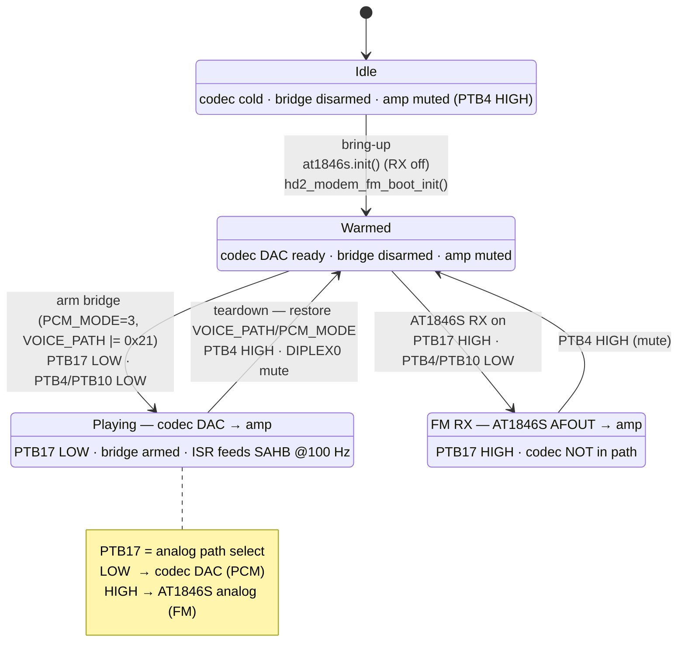

# OpenRTX Audio — CPU→Speaker PCM Playback

Implementation notes for the HR_C7000 audio output path as used by the OpenRTX
port (Miosix / CK803S). Covers the codec-DAC PCM playback route: how the CPU
streams 8 kHz mono samples to the on-chip codec and out the speaker, the
register sequence to bring it up, and the pad/GPIO routing that selects it.

All values below are HW-verified against a V2.1.3 radio.

## 1. Two audio paths share one amplifier

The speaker amplifier is fed by **two independent sources**, selected in the
analog domain (not by an audio mux register):

| Source | Signal | Used for |
| ------ | ------ | -------- |
| **AT1846S AFOUT** | analog FM demod audio, direct from the transceiver | 2-way FM RX |
| **HR_C7000 codec DAC** | class-D PWM lineout (LINE2OUT), fed CPU PCM via the SAHB bridge | beeps, voice prompts, DMR/decoded voice |

Both reach the amp over the **PTB10-gated** analog route. Which one is heard is
decided by **GPIOB PTB17** (see §5) — it is a *path select*, not a gain enable.

The codec is NOT in the analog-FM path; the AT1846S is NOT in the PCM-playback
path. Confusing the two is the classic HD2 audio dead-end.

### 1.1 Routing / playback state machine

The amplifier hears whichever source **PTB17** selects; the codec DAC additionally
needs the SAHB PCM bridge *armed* to produce samples. The lifecycle:



> Both `Playing` and `FmRx` unmute the same amp (PTB4/PTB10 LOW); **PTB17 alone
> decides which source is heard.** A DAC that converts but is silent is almost
> always stuck routed to `FmRx` (PTB17 HIGH) while trying to play PCM.

## 2. Memory map

| Region | Address | Notes |
| ------ | ------- | ----- |
| SOCSYS (modem / system control) | `0x11000000` | 32-bit registers |
| Codec byte registers | `0x16000900` | 8-bit MMIO; word reads return the byte on the low lane only |
| SAHB PCM **playback** window | `0x180000A0` | 80 × s16, 8 kHz mono — CPU writes, codec DAC drains |
| SAHB PCM **capture** window | `0x18000000` | 80 × s16 — mic/RX ADC frames appear |
| PCM frame IRQ | PIC source **0x1B** (27) | fires ~100 Hz (one 80-sample frame / 10 ms) while armed |

## 3. SOCSYS audio registers (base `0x11000000`)

| Offset | Name | Play value | Notes |
| ------ | ---- | ---------- | ----- |
| `0x00` | SYS_SOFT_RSTN | `0x1FF` (all released) | active-low, auto-releasing. Modem-boot pulses `0x1D0`. |
| `0x2C` | REG2C (clock gate) | `0xFFF0FFFC` | bit10 `mc_clk_en` (codec master clk), bits6/7 FM modem clks. Boot value `0xFFF0FF3C`. Reads back `0x00F007FC`. |
| `0x34` | DIPLEX0 (PTA pad mux) | `0x00000060` | upper bits write-only |
| `0x38` | DIPLEX1 (PTA pad mux) | write `0x07` | **reads back `0x38000007` regardless of what is written** — bits 27-29 are not writable; do not chase them |
| `0x3C` | DIPLEX2 (PTC pad mux) | `0x3FF80003` | LCD i8080 mux; the LCD/keypad scan re-asserts it continuously |
| `0x70` | DAC_CONTROL | `0x8000001F` | bit5 `pwda` clear = DAC powered |
| `0x74` | ADC_CONTROL | `0x000041C3` | baseband IF ADC latch |
| `0x80` | VOICE_PATH | `0x23` armed | bit0 PCM-bridge enable, bit5 (`0x20`) playback side; `0x02` idle |
| `0x84` | PCM_MODE | `3` armed | `0` idle |
| `0x88` | LINEOUT / PCM handshake | `0x02` | bit31 `standby_lo`: clear = codec DAC out of standby |
| `0x100` | WORK_MODE | `0x6E` | FM-analog modulator mode |
| `0x104` | RF_MODE | `0x034C9060` | AF-receive |
| `0x39C` | AF_GATE (a.k.a. SYS_INTERP_MASK) | write `0x1007F` | low byte `0x7F` = codec/DMR datapath. **bit16 reads back cleared** (FM_TX_INTERP one-shot); write the full `0x1007F` to match the vendor. |
| `0x3B0` | INT_STATUS | — | PCM frame handshake. ACK each frame: `|= 0x20` (play) / `|= 0x10` (capture). |

## 4. Codec byte registers (base `0x16000900`) at play time

| Reg | Value | Meaning |
| --- | ----- | ------- |
| `0xC8` | `0xC0` | AICR_DAC: master, enabled, parallel, 8 kHz |
| `0xC9` | `0xC0` | AICR_ADC |
| `0xCD` | `0x20` | DAC analog stage; bit7 (soft-mute) **clear** |
| `0xD2` | `0x0C` | CR_VIC |
| `0xD3` | `0x40` | bit4 = MCLK shutdown (must be clear) |
| `0xDF` | `0xB4` | **DAC-L output gain** (`CODEC_DACL_GAIN`) |
| `0xE5` | `0x8B` | — |

## 5. Speaker-amp GPIO (GPIOB `0x14100000`)

| Pin | Bit | Role | Play state |
| --- | --- | ---- | ---------- |
| PTB4 | `0x10` | amp mute — **HIGH = muted** | LOW |
| PTB10 | `0x400` | analog route gate — **LOW = routed to amp** | LOW |
| PTB13 | `0x2000` | power self-latch — HIGH = hold rail | HIGH (leave alone) |
| **PTB17** | `0x20000` | **path select** — LOW = **codec DAC**, HIGH = AT1846S analog | **LOW for PCM playback** |

Working play-time `GPIOB_DR = 0x0050E004`.

> **PTB17 is the single most important routing bit for PCM playback.** Earlier
> FM-RX work found "PTB17 HIGH" enabled 2-way audio — because HIGH routes the
> AT1846S analog path. For **codec DAC** playback it must be **LOW**; driving it
> HIGH feeds the amp the AT1846S input instead, so the DAC converts correctly
> (frame IRQ fires, samples in SAHB) but nothing is heard — or only demod static
> if the AT1846S RX is on.

## 6. Bring-up sequence

Runs once at radio init, matching the vendor `radio_init` order:

1. **`at1846s.init()`** — full chip init + VCO calibration, left **RX OFF**
   (`reg 0x30 = 0x4006`). The codec DAC will not convert unless the AT1846S
   chip-init has already run. RX is *not* required for PCM playback and leaving
   it off avoids demod static on the shared node.
2. **`hd2_modem_fm_boot_init()`** — in this order:
   - `REG2C = 0xFFF0FFFC` (modem/codec clock gate)
   - `SYS_SOFT_RSTN = 0x1D0` (modem reset pulse; codec[4]+adc_ctrl[6]+sys[7]+cpu[8] released)
   - codec byte init (reset pulse, AICR/DAC config, PCM handshake wait, gain `0xB4`)
   - route DAC-out pads, DAC bias, then the full SOCSYS FM gate (§3 values)

> **Order matters:** the modem reset (`SYS_SOFT_RSTN`) must run with the AT1846S
> **RX off**. Enabling RX before the modem reset resets the datapath while the
> AT1846S is feeding it and corrupts the codec output.

## 7. Per-playback: the SAHB PCM bridge

To play a buffer of 8 kHz mono s16:

```
arm:   SYS_SOFT_RSTN |= 0x18          # release PCM blocks (bits 3/4)
       PCM_MODE       = 3
       VOICE_PATH    |= 0x01          # PCM-bridge enable
       VOICE_PATH    |= 0x20          # playback side
       register ISR on PIC source 0x1B
       prime: write frame 0 to 0x180000A0, then INT_STATUS |= 0x20
open:  DIPLEX0 audio-unmute, PTB4 LOW, PTB10 LOW, PTB17 LOW
```

The frame ISR (~100 Hz) acks `INT_STATUS |= 0x20` and copies the next 80 samples
into `0x180000A0`.

**Teardown (required to STOP the tone):** restore `VOICE_PATH` and `PCM_MODE` to
their pre-arm values — this disarms the bridge; otherwise the codec keeps looping
the last SAHB frame forever. Re-muting the amp (PTB4 HIGH) + `DIPLEX0` audio-mute
alone does **not** stop playback.

## 8. Power-off interaction

Bringing up the modem/codec has a side effect on shutdown. The Miosix
`shutdown()` drops the PTB13 latch and issues a SOCSYS soft-reset so the radio
recovers cleanly even when the rail is externally held (USB cable). That reset
must also assert the **modem/audio block resets**: clearing only CPU+system
(`SYS_SOFT_RSTN = 0xFFFFFE7F`) leaves the modem blocks running across the reset,
and the post-reset `clk_init` then hangs ("won't power up until the cable is
pulled"). Resetting bits 0-8 together (`SYS_SOFT_RSTN = 0xFFFFFE00`) gives the
reboot a clean clock state. This only manifests once the modem has been brought
up — a build that never touches the modem powers off fine either way.

## 9. Debugging checklist

The DAC converts but nothing is heard — work down this list:

1. **PTB17 LOW?** (`GPIOB_DR & 0x20000 == 0`) — the #1 cause. HIGH routes the
   AT1846S, not the codec.
2. PTB4 LOW (amp unmuted), PTB10 LOW (routed).
3. Frame IRQ firing? (~100/s on PIC 0x1B) — if 0, the bridge arm is wrong.
4. SAHB `0x180000A0` holds your samples? (read them back)
5. Codec out of standby (`0x88` bit31 clear), DAC unmuted (`0xCD` bit7 clear),
   gain `0xDF = 0xB4`.
6. AT1846S chip-init ran *before* the modem boot.

A register snapshot that matches a working unit but is still silent is almost
always **PTB17** — it is a pad routing bit, invisible unless you dump `GPIOB_DR`.
